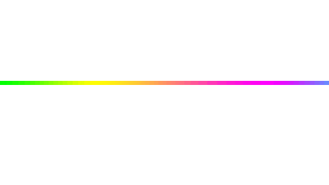

<!-- 👋 GREETING -->

  <picture>
  
  </picture>

<!-- FUN GIF -->

  <picture>
  
  </picture>

  

<!-- LINE -->
<picture>

</picture>

<!-- ABOUT ME -->
### 🧑‍💻 About Me
- 🏦 Full-Stack Software Developer – Backend & Mobile Systems
- 💻 Daily: **React Native, PHP, JavaScript, MySQL**
- 🧠 Skilled in: **Redux, TypeScript, Advanced React Native**
- ⚡ Fun Fact: I speak **Malayalam, English, Hindi**

<!-- CONNECT -->
### 🔗 Connect with me

  
   
  

<!-- WEBSITES -->
### 🌐 Websites

  
  
  

<!-- TECH STACK -->
<picture align="center">

<picture>
<!-- GitHub Stats Section -->
<!-- ### 📈 GitHub Stats  -->
<table align="center" border="0" cellspacing="0" cellpadding="0" style="border-collapse: collapse;">
<tr>
  <td style="border: none;">
    <picture>
      
    </picture>
  </td>
  <td style="border: none;">
     <picture>
        
     </picture>
  </td>
</tr>
</table>

<!-- GITHUB CONTRIBUTION SNAKE --> 
<!-- ### 🐍 GitHub Contribution Snake  -->

  <picture>
      <source media="(prefers-color-scheme: dark)" srcset="assets/svg/github-dark.svg">
      <source media="(prefers-color-scheme: light)" srcset="assets/svg/github-light.svg">
      
  </picture>

<!-- FUN QUOTE -->
<!--  <strong> 💬 Fun Quote </strong>  -->

<i>“Programming isn’t about what you know; it’s about what you can figure out.”</i>

<!-- FOOTER ANIMATION -->

  <picture>
    
  </picture>

